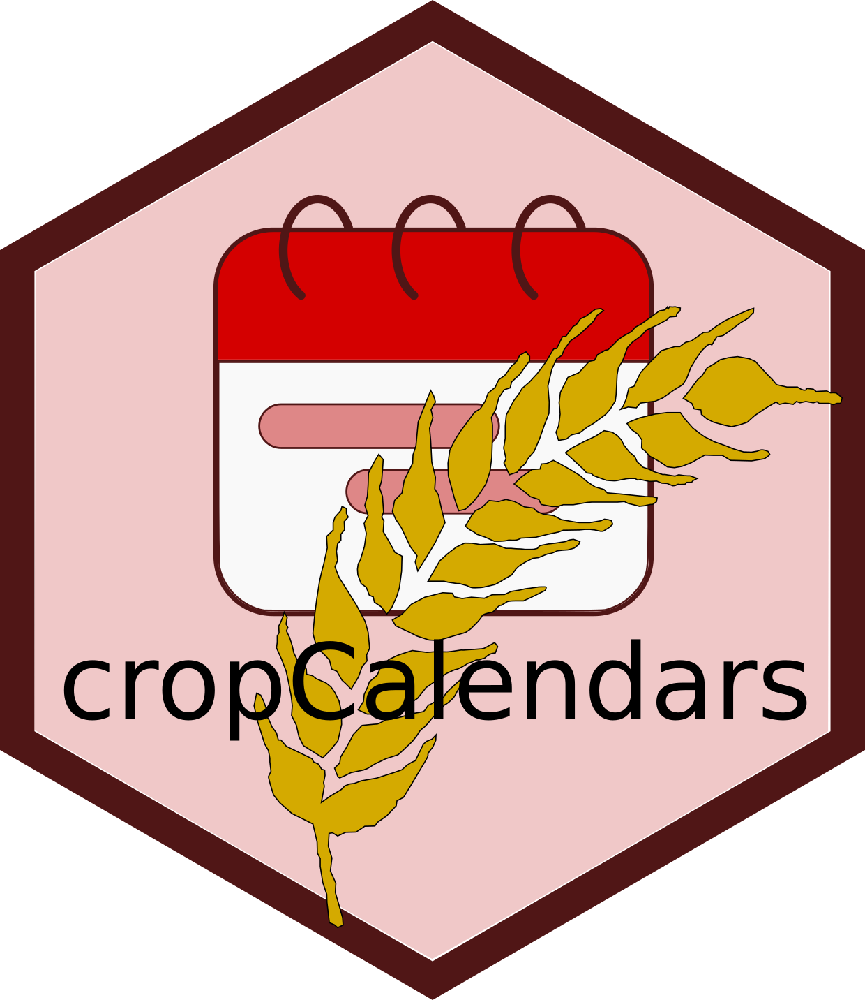

# cropCalendars <a href=''></a>

R-package for simulating crop calendars and their adaptation following the approaches from [Waha et al. (2012)](https://doi.org/10.1111/j.1466-8238.2011.00678.x) and [Minoli et al. (2019)](https://doi.org/10.1016/j.gloplacha.2018.12.013).

## Installation

```bash
git clone https://github.com/AgMIP-GGCMI/cropCalendars.git .
cd ..
R CMD build cropCalendars
# this generates e.g. cropCalendars_0.1.0.tar.gz
R CMD INSTALL [-l my/Rlib/path] cropCalendars_0.1.0.tar.gz
```

Alternative in R with `devtools`

```r
library(devtools)
devtools::build()
devtools::install()
```

## Usage

See examples in `./utils`

```r
library(cropCalendars)

# Main functions
climate <- calcMonthlyClimate()
crop_calendars <- calcCropCalendars()
phenological_heat_units <- calcPHU()
```

## Contact

- Sara Minoli (sara.minoli@pik-potsdam.de)

```
Potsdam Institute for Climate Impact Research (PIK)
Member of the Leibniz Association
14412, Potsdam, Germany
```

## References

```
@article{Waha2012,
  title={Climate-driven simulation of global crop sowing dates},
  author={Waha, K and Van Bussel, LGJ and M{\"u}ller, C and Bondeau, Alberte},
  journal={Global Ecology and Biogeography},
  volume={21},
  number={2},
  pages={247--259},
  year={2012},
  doi={https://doi.org/10.1111/j.1466-8238.2011.00678.x},
  publisher={Wiley Online Library}
}

@article{Minoli2019,
  title={Modelling cropping periods of grain crops at the global scale},
  author={Minoli, Sara and Egli, Dennis B and Rolinski, Susanne and M{\"u}ller, Christoph},
  journal={Global and Planetary Change},
  volume={174},
  pages={35--46},
  year={2019},
  doi={https://doi.org/10.1016/j.gloplacha.2018.12.013},
  publisher={Elsevier}
}
```